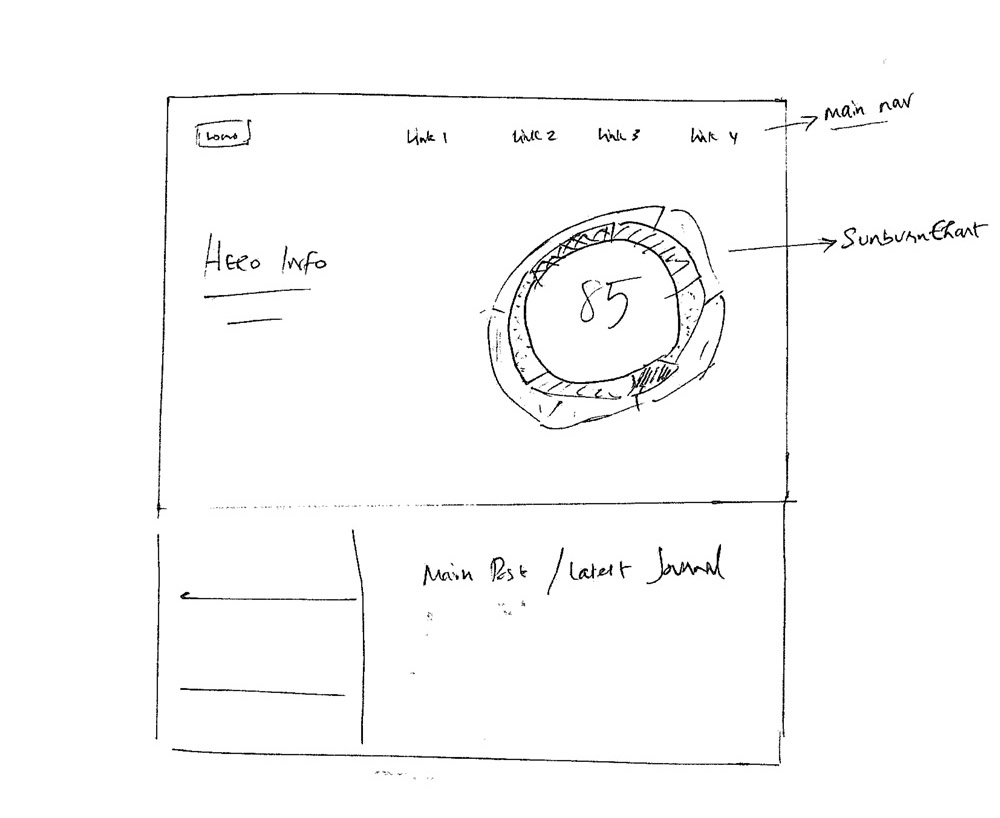
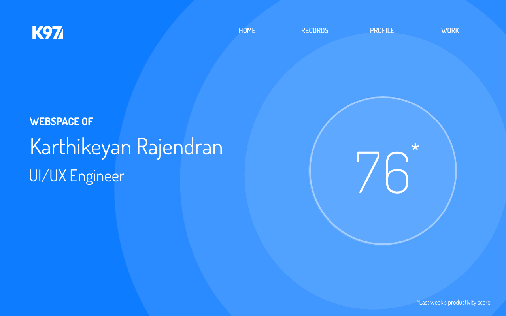
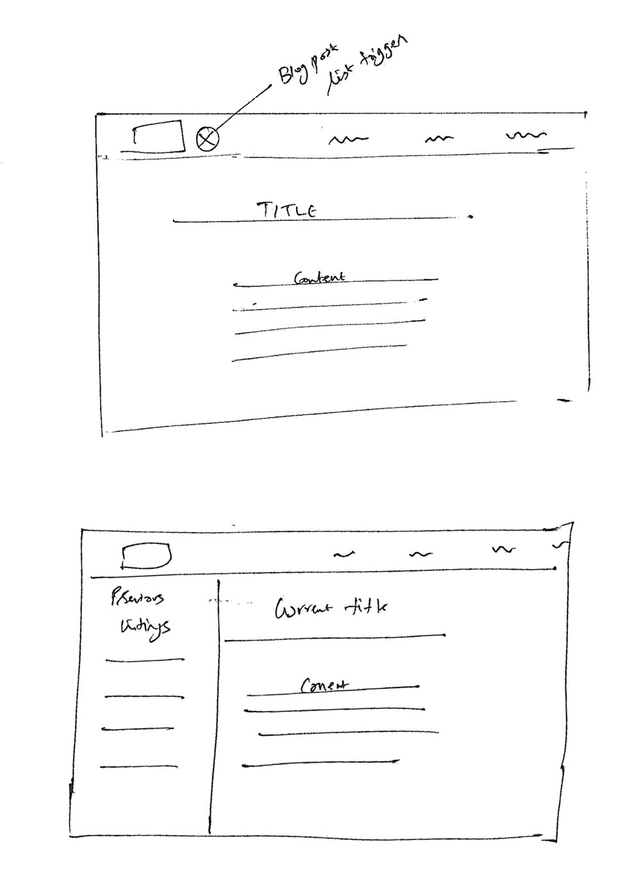
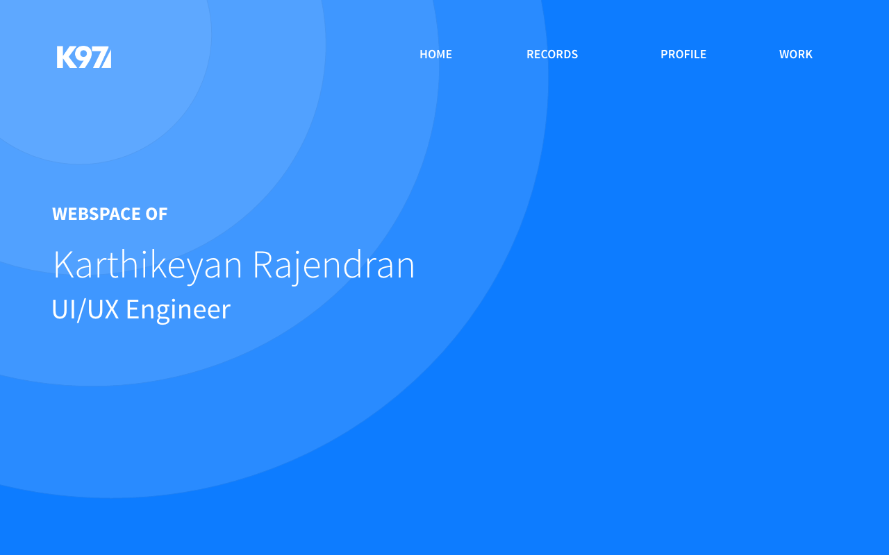

*I'm doing yet another iteration on my website. Unlike the previous versions, I want the next one to hold for a longer span. In the coming weeks, I will be logging the process here, so it can stay as a reference material.*

### Problem(s)
The last verion had some teething problem in terms of logging data across the sections. Whenever I dealt with new content, either the setup was getting in the way or the templates. In hindsight, Angular and Jekyll setup didn't really workout and gh-pages wasn't ideal in maintaining the blog and the portfolio as separate entities. Apparently, I lost the setup for the blog and the re-setup was slightly tedious that I couldn't fire up the blog again. I want to avoid all this aggravation in the next version and keep the logging process simple.

### Resolution
The content is going to be in created in Markdown, so that's sorted. Now, the choices are between compiling the markdown on the browser using a JS parser mixin or generate a compiled markup during deployment and then serve it as static pages or as services. If I approach it with the later choice, then the app might involve a backend module using ExpressJS and to host it, either Heroku or Firebase can a good option.

### Designs
I've few wireframes sketched out and also designed few mockups to get a direction on the design elements. Upon completion of the mockups, it looked to be plenty enough for me to start the work. As far as iterations are concerned, usually I do it on the browser while coding and I want to follow the same approach. The design elements are generally going to some sort of a chart, and the idea is to consume my RescueTime data and display the my usage analytics at a high level for the initial release. This will allow me to gather data from multiple devices and publish it to a single public interface.

<figure class="">
	
	<figcaption>Landing page wireframes</figcaption>
</figure>

<figure class="">
	
	<figcaption>Landing page design mock</figcaption>
</figure>

The idea of habit tracking and time-tracking tools were something that I wanted to develop for sometime. Meanwhile, I was thinking about the various methods on how to achieve this, Gyroscope was released. According to their website, Gyroscope is an app that shows a consolidated interface of all the user's data from multiple devices into a single interface. No one can deny the fact that Gyroscope is a beautifully designed application. I got inspired by the app and then it lead to a rough idea on how I can approach my thoughts. To set things clear, I am gonna try hard enough not to copy anything intentionally from there, which by itself is a stern design challenge.

### What's ahead?
The plan is to keep the portfolio and the blog section separate as similar to the old site. Only this time around, I've to be extra careful in managing the modules being independent. To achieve that, I'm planning to build the whole technical solution using a single framework. After using NG2 for an app at work, I was quite convinced with the component approach, plus I've been working with AngularJS for quite sometime now, which has left me wondering on the other JS frameworks. Besides, I want to check things on Aurelia and ReactJS. Especially, the React ecosystem sounds more interesting and the added buzz makes it more appealing. I think its the right time to do this project using it and treat this work as an experiment with the core concepts of React.

With some much in the backlog and other projects taking majority of my time, its going to be tricky to manage time in the coming days. But I've wasted enough time postponing this work and I'm just excited to work with React.

#### More designs
<figure class="">
	
	<figcaption>Journal reference wireframes</figcaption>
</figure>

<figure class="" style="margin-bottom: 50px;">
	
	<figcaption>Another version of hero section</figcaption>
</figure>

