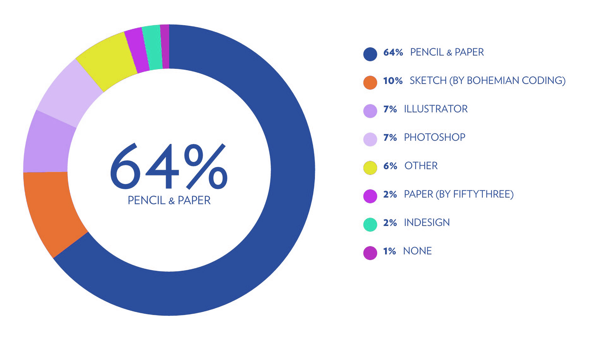

*The intricacies of requirement gathering using various tools in design & development of user interfaces*

Recently, I have been involved in the design and development of an airline servicing app as UI developer. My role also involves working closely with the designers to check with the feasibility of the designs they are producing and feed in the concerns *(if any)* before starting with the development. This process also works the other way around and it's an interesting role to play, since the feedback I pass should be constructive for them to keep their work in a progressive path.

At times, I found this is to be tricky, since critiquing a design was like threading a fine line which often trigger the designer’s ego or make me look like an absolute duffer, if a false alarm was set off. This meant, I had to be extra careful before passing any comment and also make sure the nature of the comment should be constructive and should help the designer rather than distract the entire process. I enjoyed doing it, since the designer side of me gets excited and usually this is where I get to exercise my design skills (at times, when I wanted to a mockup a flow or screen). Eventually, I took this up as a challenge to pass a feedback only if the particular design doesn’t solve the problem or if it doesn’t work in terms of interaction. After a while, this process also got trickier, passionate designers usually find it difficult to move away from their initial solution. I know this because, I have experienced this and have also heard designers share the same.

Iteration is a key part in evolving a design and getting back to drawing board to reinitiate the whole process again in a fairly big team like ours was often a pain in the ass. I say that because, sometimes end-users have a sneak peak of the design and get stuck with it irrespective of the critique or there will strict deadlines to adhere.

During one of these crits, a developer pointed out a designer’s habit, which I found it to be interesting. Collecting requirements in wireframe. It sounds a like a personal preference for anyone, even I can’t thoroughly deny doing it but I have not exercised it often to become a habit or preference. I say that because, my go-to tool for note taking in my workplace is Wunderlist (I have a huge number of lists going on in it and I would personally suggest it to anyone) or my primary code editor. Coming back to the topic, requirement gathering is an age-old task and people use tools like text editors or even a paper to do it. After giving it some thought, I realized how bad it is to gather requirements in wireframe.

<figure>
	
	<figcaption>
		Survey result: Primary tool for brainstorming and ideation. <i>Ref: <a href="http://tools.subtraction.com/brainstorming.html" target="_blank">subtraction.com</a></i>
	</figcaption>
</figure>

Wireframes are usually a place to iterate before jumping into a high-fidelity mock. I have seen at times designers being reluctant to move away from their initial iteration, sometimes it’s a complex scenario they are dealing which is difficult but other times, it’s that wireframe which they used to collect requirement standing as a virtual roadblock. The mind tends to fall back to that wireframe whenever a requirement has to be processed and without the designer realizing it, he/she tend to feed the same solution in most of their iterations. The resultant mockup usually looks close to the wireframe and by the time the designer takes up another iteration (which mostly is after the review process and if the design is flagged to be insufficient), it becomes very late in terms of delivery.

Now looking at it retrospectively, setting up a process would help us address these problems. What if, the root cause remained undetected? That would mean, the consequence would never change. It’s difficult to detect a cause like this one, since this remains is an elementary step which often is a personal preference and changing it is slightly difficult. This is the same case even for a developer, sticking to the initial pseudo code without thinking much about problem would lead to a recursive cycle of the same error or issue without arriving to a conclusion. By the time the developer realizes it, good amount of time would have been wasted already.

When thinking about it, this is what I am opinionated to as of now, one has to take notes subjectively without thinking about the solution in any shape or form when doing it. Even if, a solution is to be recorded while gathering the requirement its absolutely necessary that, the person has to go the extra mile to find all the other possible ways of solving it, before iterating upon one solution. Also, I am going to take this up in my future conversations with the designers & developers and see how they feel about it.
