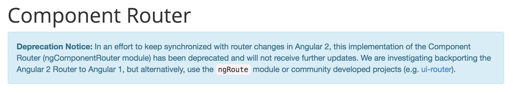

*Using the ui-router beta with ng 1.5.x component and porting the old routers to the new UI router.*

The intention of this post is to quickly log my router setup experience for angular 1.5.x component based application. I have been working on several angular projects for quite some time now, most of these projects are 1.x based and couple of them were on ng2. Among those 1.5.x projects, there was huge project which started on 1.3.x version quite sometime back 2015. I joined the project late 2016 for new development activity, I had already completed a project on ng2 and I knew sooner or later we had to port this slowly towards component based approach. So, we planned out the framework upgrades incrementally and started rolling out one by one. The initial upgrades until were quite easy without much breaking changes but when we hit 1.5.0, we were quite excited to start using the component pattern.

The [angular docs](https://docs.angularjs.org/guide/component) were a good place to start off and the blog post from Todd was also really helpful in terms of dealing with components. So, we started of creating new components rather than directives until we hit a speed bump on one of the core business module, let’s just say it a form builder of sorts. This module consisted of so many widgets, which were supposed to be reused and the obvious thing was to hit the component approach in full throttle. So, we looked at the router and angular's in house router had a warning sign for deprecation and reference pointing to use the ui-router’s component version.

<figure>
	
	<figcaption>Deprecation Notice: Component Router for AngularJS 1.5</figcaption>
</figure>

The setup was slick since we were already using ui-router and we had to deal with few broken routes while porting but it was worth it. The form builder module itself deserves a separate log, I will try to cover it later. If not, I will record it as a workflow/case-study in the new site that I'm working on. So, the route configuration looks like this:

It obviously addressed the concerns of tightly coupling the views with controllers and promote reusable pieces of code. Another big sigh of relief was passing state via the router. Now thanks to the bindings of ng 1.5x component pattern, we can use and abuse property bindings. event lifecycle hooks and mostly importantly setup the codebase more favorable for a ng-upgrade towards ng2.

As a hot tip, one-way binding is pretty easy now with the component pattern and the new router. When creating any component with bindings, just make sure it’s started with one-way binding. Most of the functionality can be archived this way and if some edge case crops up, then we can revisit the property. By following this, I was able to refactor the old functionality which existed earlier as two-way binding hell to a slick one-way data flow.

The next slick thing that was really easy to create and maintain was a dynamic widget creation and scope-isolated components. Long story short, the components were created from a configuration through a directive and then compiled to a DOM element through `$compile` before injecting. Once added to the DOM, the element starts to run as a usual angular component. This basically, gave us the flexibility to create dynamic components and reuse the configuration across the app. The code snipped looked like below:

The next planned activity is to fully modularize the app with ES6 modules before starting the ng-upgrade sometime down the line. But looking at the router and the lesser state dependency, I think upgrade should be quite simple and straight forward.
